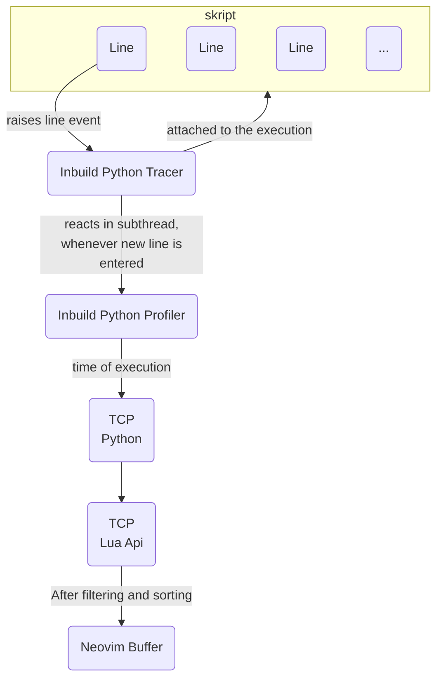

# Early development state!
Usage at own risk! 
The times for execution do not match the real once due to inconsistencies of the python setprofile functionality. 
If there are better possibilities to integrate contact me or do a pull request.

# Structure

